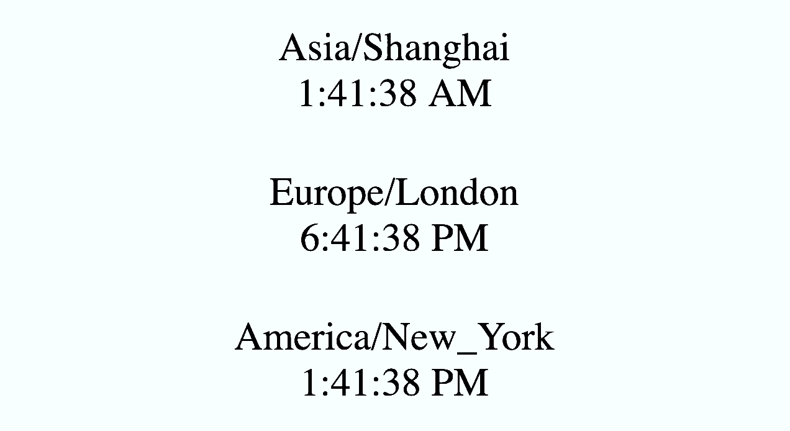

# React Hooks

---

### Basic Example

---

### Common Styles

@code[css](code/lightbulb.css)

[Get the Code](https://raw.githubusercontent.com/wyncode/gitpitch_react_hooks/master/code/lightbulb.css)

---

### Manual DOM Manipulation

@code[sh](code/lightbulb_simple_vanilla.html)

@[13,17,18,20](Hard code in the default state into the HTML)
@[23-25](Query the dynamic elements from the DOM)
@[27-37](Write a function that manually changes the DOM)
@[39](Attach the function to an event handler)

[Get the Code](https://raw.githubusercontent.com/wyncode/gitpitch_react_hooks/master/code/lightbulb_simple_vanilla.html)

---

### React Class Component

@code[sh](code/lightbulb_simple_react_class.html)

@[17-18](Declare the initial state inside a class component)
@[20-22](Declare an instance method that can change state)
@[24-26](Declare a render function that returns some JSX)
@[27,32,35](Declare how the component should display in various states)
@[42](Have ReactDOM render the class into the DOM)

[Get the Code](https://raw.githubusercontent.com/wyncode/gitpitch_react_hooks/master/code/lightbulb_simple_react_class.html)

---

### Stateless Components

@code[sh](code/lightbulb_simple_react_functional.html)

@[17-22](State and functions that can change state are declared in the outermost class component)
@[24-32](State and functions can be passed down to child components as props)
@[35-42](Child components are stateless functions that return JSX based on the value of their props)
@[44-48](Behaviors are injected as props from the smart containter component)

[Get the Code](https://raw.githubusercontent.com/wyncode/gitpitch_react_hooks/master/code/lightbulb_simple_react_functional.html)

---

### Stateful Functions

@code[sh](code/lightbulb_simple_react_hooks.html)

@[17-22](useState to maintain state in a functional component, declare individual functions inside to change state)
@[24-36](Just return JSX instead of using a render function, otherwise this is the same as if it were a class Component)

[Get the Code](https://raw.githubusercontent.com/wyncode/gitpitch_react_hooks/master/code/lightbulb_simple_react_hooks.html)

---

### Functional Context

@code[sh](code/lightbulb_simple_hooks_context.html)

@[17-26](Create a context and a provider for that context.  The provider takes some local state and makes it accessible to any of its children that want to use that context.)
@[28-36](The Room will want to use the LightContext.  So will the Lightbulb and the LightSwitch.  However, we can now decouple them and avoid having to pass down state as props.)
@[38-48](The Lightbulb can consume the LightContext independent of the Room)
@[50-62](Same goes for LightSwitch.  And now, the function that changes state lives in a place that makes a little more sense.)
@[64-70](To make this work, we have to wrap the whole room in the LightProvider.  Lightbuld and LightSwitch get access because they are children of room.  ReactDOM renders the whole app, not just the Room.)

[Get the Code](https://raw.githubusercontent.com/wyncode/gitpitch_react_hooks/master/code/lightbulb_simple_react_hooks_context.html)

---

### Pros / Cons

* Classes no longer needed (performance enhancement?)
* No need to remember `bind` or `this` (who cares?)
* Enhanced access to Context API (Helps decouple presentation from data)
* This is more code but...
* Reduces need for Redux (none of these examples needed Redux, but you get the idea)

---

## Lifecycle / useEffect

---

### Class Clock

@code[sh](code/clock_react.html)

@[24-25](Declare the initial state inside a class component)
@[35-37](Declare an instance method that can change state)
@[39-45](Declare a render function that returns some JSX)
@[27-33](Lifecycle methods may reference the instance `this`)

[Get the Code](https://raw.githubusercontent.com/wyncode/gitpitch_react_hooks/master/code/clock_react.html)

---

### Hooks Clock

@code[sh](code/clock_react_hooks.html)

@[24-25](Declare initial state in a functional component)
@[27-29](Declare a function that can change state)
@[39](Return some JSX)
@[31-37](useEffect instead of lifecycle methods)
@[32-35](useEffect takes a function...)
@[36](...and an array of dependencies -- in this case there are none)
@[33](Set up similar to componentDidMount)
@[34](Tear down similar to componentWillUnmount)

[Get the Code](https://raw.githubusercontent.com/wyncode/gitpitch_react_hooks/master/code/clock_react_hooks.html)

---

## Context Clock

---

### Context Clock

@code[sh](code/clock_react_hooks_context.html)

@[24-26](Create a context and a provider for that context.)
@[27](The provider takes some local state...)
@[41-45](and makes it accessible to any of its children that want to use that context.)
@[29-31](Declare a function that can change state)
@[33-39](useEffect instead of lifecycle methods)
@[48-60](Clock is a functional stateless component)
@[49](That consumes the TimeContext)
@[53,56](And accepts a timeZone as a prop)
@[62-68](App wraps 3 different clocks, each with its own timeZone, in a TimeProvider)
@[70](ReactDOM renders the whole app inro the body)

[Get the Code](https://raw.githubusercontent.com/wyncode/gitpitch_react_hooks/master/code/clock_react_hooks_context.html)

---

## React Forex

---

